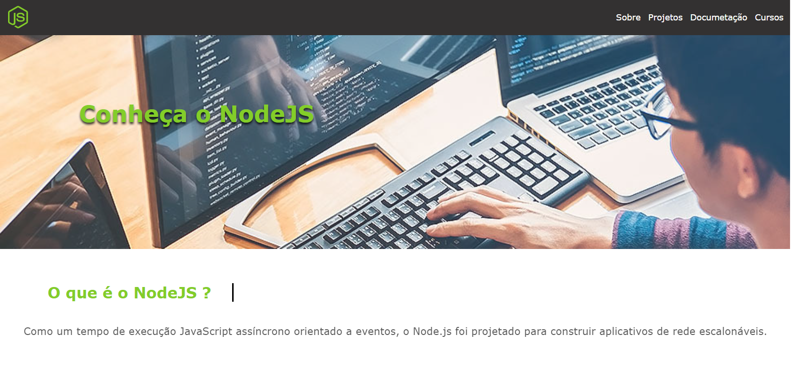

# Sobre

- Criando uma aplicação Full-Stack para fins didáticos com NodeJS, inicialmente a idea é que usuário dos sistemas
terão acesso para cadastrar noticias e materías sobre diversas linguagens de programação para fins didáticos. 

### Desenvolvimento 
* Atualmente o projeto está sendo construído todas as paginas utilizando template engine, por que futuramente 
irei implantar o Back-End utilizando nodeJS.

### Como instalar na sua maquina
1 - Clone o projeto https://github.com/Felipe118/front_end.git  
2 - crie um banco mysql no seu ambiente como nome node_news  
3 - tenha instalado o node e o npm em sua maquina  
4 - execulte o comando npm install para instalar as dependecias  
5 - depois execulte npm start  
6 - abra em seu navegador na porta 3000: http://localhost:3000/  

#### Status
 <h4 align="center"> 
	🚧  ... Projeto 🚀 Em construção...  🚧
</h4>

## FEATURES FUTUROS

- [x] Fazer a autenticação de usuários;
- [ ] Incluir o cadastro de noticias sobre diversas linguagens de programção;
- [ ] Incluir novas funcionalidades;
- [ ] Criar um guia completo auto explicativo sobre varias linguagens de programação do mercado.

### TELA

